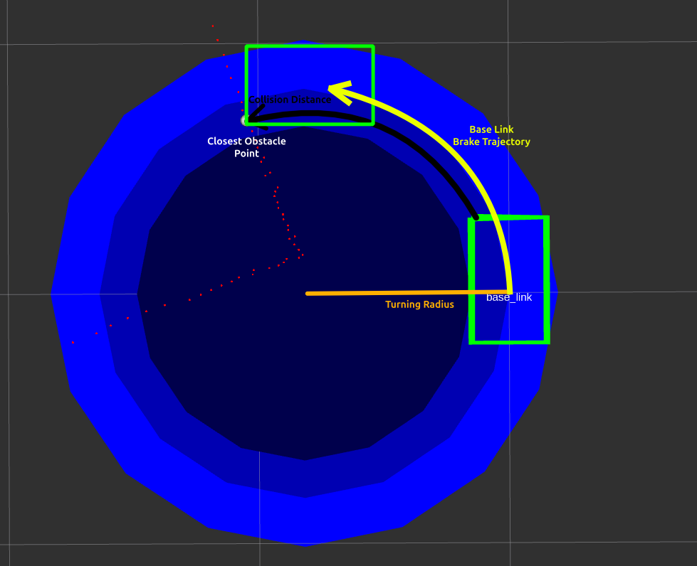

# collision_restraint
ROS2 module to prohibit rectangular robots from driving into obstacles (PointCloud2 points) by restraining 2D twist command velocities.  
Example usage: Save teleoperation.

Work in Progress:  
1. Snoozing
2. Collision prevention for negative linear velocities (backwards driving)

Unsupported:
1. Non-rectengular footprints
2. Motion models different from linear + angular velocity
3. Respecting / enforcing actual dynamics of robot (e.g. acceleration limits for velocity adjustments)
4. Feedback based slowing down (actual velocity of robot (odom) is ignored, feed forward only)



## Quick Guide
* Input obstacles as `PointCloud2` on topic `/collision_restraint/sub_point_cloud` 
* Input command velocties on `/collision_restraint/sub_cmd_vel` / `/collision_restraint/sub_cmd_vel_stamped`
    * Expects linear velocity on `twist.linear.x` and angular velocity on `twist.angular.z`
* Output command velocities on `/collision_restraint/output` / `/collision_restraint/output_stamped`
* Adjust footprint, deceleration and other parameters in the `config/default.yaml`
* Visualization available on `/collision_restraint/visual/*`

### Nav2 test / demo setup
For testing with the nav2 turtlebot simulation (`ros2 launch nav2_bringup tb3_simulation_launch.py`), simply launch:

```
ros2 launch collision_restraint test_launch.py
```
(needs the `pointcloud_to_laserscan` package)

As input the rqt robot steering can be used:
```
ros2 run rqt_robot_steering rqt_robot_steering
```
Set the steerint output topic to:
```
/collision_restraint/sub_cmd_vel
```

### Parameters
See comments in [the default config file](config/default.yaml)


## Technical Details
The motion model used is very simple and there is no feedback used ("forward only").  
The implementation is in [the MotionModel class](src/motion_model.cpp) and should be straight forward.

The calculation of the distance towards obstacles is done using polar coordinates and the main complexity of the package. See [Distance Calculations](#distance-calculations) below.


### Parameters


### Distance Calculations
