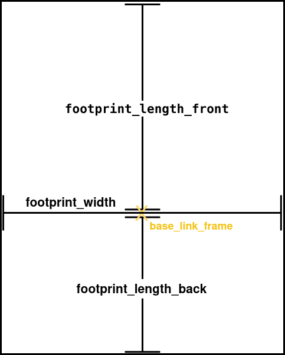
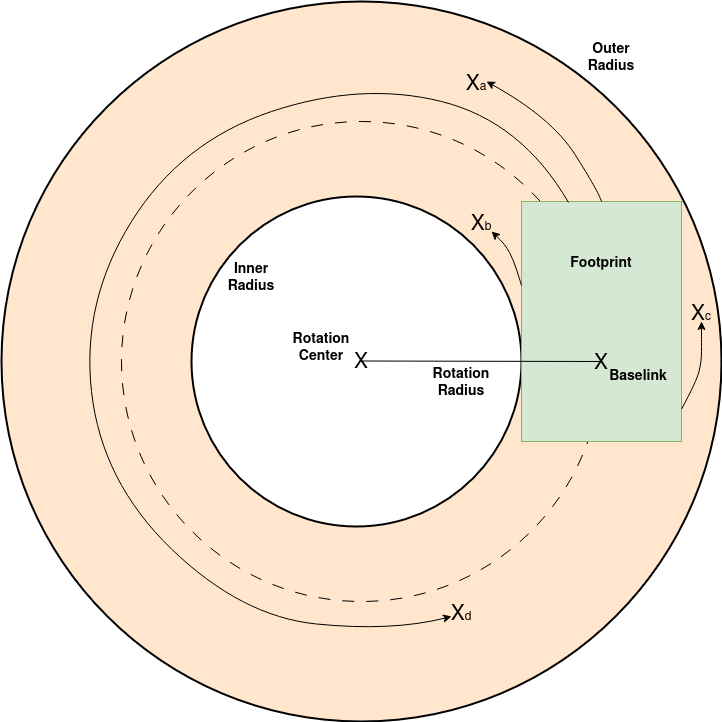
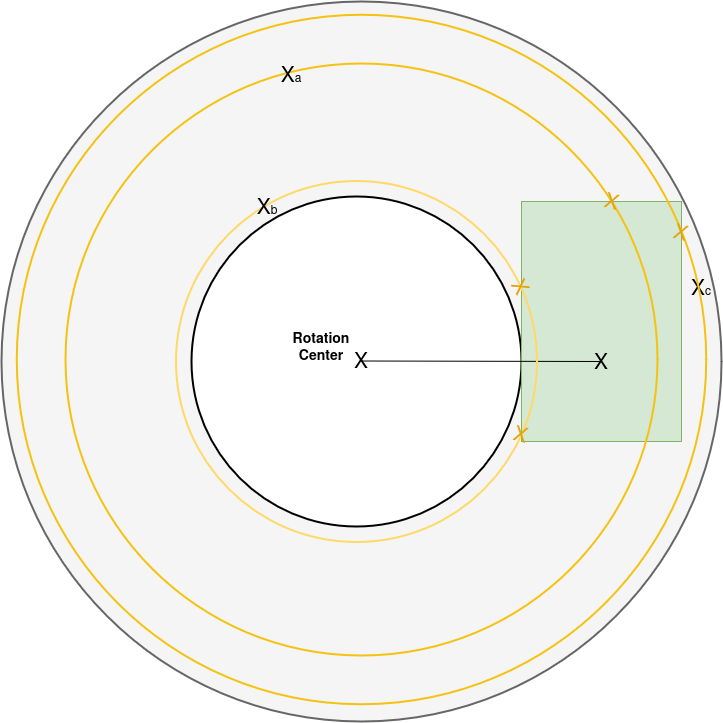

# collision_restraint
ROS2 module to try to prohibit rectangular robots from driving into obstacles (PointCloud2 points) by restraining 2D twist command velocities.  
Example usage: Saver teleoperation.

Work in Progress:  
1. Collision prevention for negative linear velocities (backwards driving)

Unsupported:
1. Non-rectengular footprints
2. Motion models different from linear + angular velocity
3. Respecting / enforcing actual dynamics of robot (e.g. acceleration limits for velocity adjustments)
4. Feedback based slowing down / velocity limiting (this package ignores the actual velocity of robot (odom), feed forward only)
5. Respect 3D in terms of obstacle distance / trajectories 


## Quick Guide
* Input obstacles as `PointCloud2` on topic `/collision_restraint/sub_point_cloud` 
* Input command velocties on `/collision_restraint/sub_cmd_vel` / `/collision_restraint/sub_cmd_vel_stamped`
    * Expects linear velocity on `twist.linear.x` and angular velocity on `twist.angular.z`
* Output command velocities on `/collision_restraint/output` / `/collision_restraint/output_stamped`
* Adjust footprint, deceleration and other parameters in the `config/default.yaml`
* Visualization available on `/collision_restraint/visual/*`

### Nav2 test / demo setup
For testing with the nav2 turtlebot simulation (`ros2 launch nav2_bringup tb3_simulation_launch.py`), simply launch:

```
ros2 launch collision_restraint test_launch.py
```
(needs the `pointcloud_to_laserscan` package)

As input the rqt robot steering can be used:
```
ros2 run rqt_robot_steering rqt_robot_steering
```
Set the steerint output topic to:
```
/collision_restraint/sub_cmd_vel
```

### Parameters
See comments in [the default config file](config/default.yaml)


## Technical Details
The motion model used is very simple and there is no feedback used ("forward only").  
The implementation is in [the MotionModel class](src/motion_model.cpp) and should be straight forward.

The calculation of the distance towards obstacles is done using polar coordinates and the main complexity of the package. See [Distance Calculations](#distance-calculations) below.


### Parameters

#### Footprint



#### distance_buffer
Buffer subtracted from the distance to the obstacle. Resulting in the robot stopping this distance in front of the obstacle.

```
distance_for_velocity_scaling = distance_to_obstacle - distance_buffer;
```

### Distance Calculations
The distance calculations for the straight driving case are trivial. The angular velocity threshold for straight driving is defined in [params.hpp](include/collision_restraint/params.hpp).

For the distance in case of turns the footprint borders and obstacle points are converted into polar coordinates around the rotation center of the robot trajectory.



As can be seen different sides 'hit' the obstacles marked with "x" first along the circular trajectory.  
The front hits "a" and "d". The left side hits "b" and the right side "d".

In polar coordinates the trajectory represented by a circle going through an obstacle point can intersect each footprint border line up to two times.


Which intersection point we want is clear from the driving direction as obstacles will be hit only one way.

The actual distance then can be calculated from the angle difference between the obstacle point and intersect.  
The angle distance can then be converted into euclidean distance using the radius of the point.

```
angular_distance = point.theta() - theta_intersection;
euclidean_distance = angular_distance * point.radius();
```

Additional remarks:
1. In case of non-zero inner turning radius, the footprint back border will never hit anything first outside of the footprint
2. For right turns we simple mirror the obstacle point along the x-axis of the robot base link
3. The border line representation in polar coordinates can be simplified as they are along the x/y-axis
4. Obstacle points can be ignored if their polar coordinate radius is outside of the border line min/max radii

## FAQ

1. _Does the package ensure in every case, that we don't drive into an obstacle?_  
   No, as it does not respect the robot dynamics. It will assume the output velocities are instantanously reachable by the robot.  
   In reality this is of course not the case. E.g. if you drive straight along a wall and suddenly steer into the wall, the robot might still hit the wall.
   The same case if someone jumps directly in front of your robot.
   
2. _Why does the robot drive close to obstacles even if I set a high `distance_buffer`?_  
   The distance buffer is only along the trajectory of the robot. The robot will still go closer to an obstacle if it is not on the trajectory.  
   So, it is possible to drive by very closely, as long as the obstacle is not hit.

   
